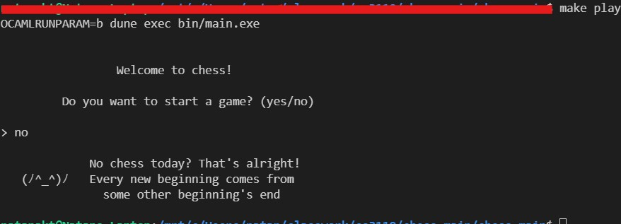
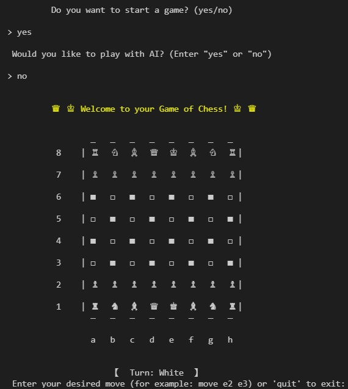
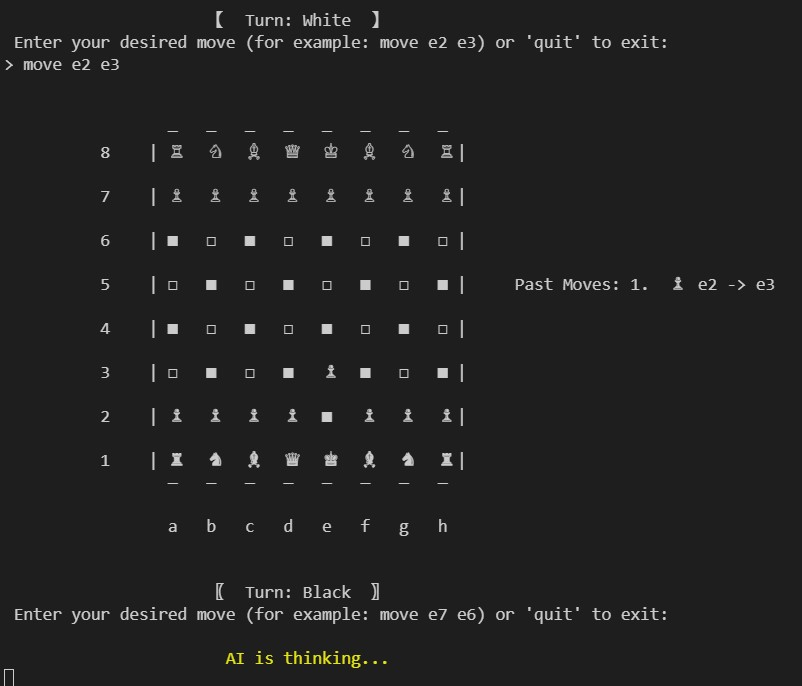
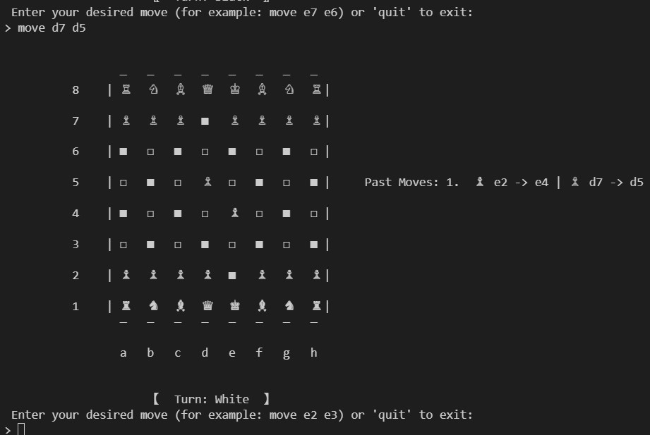
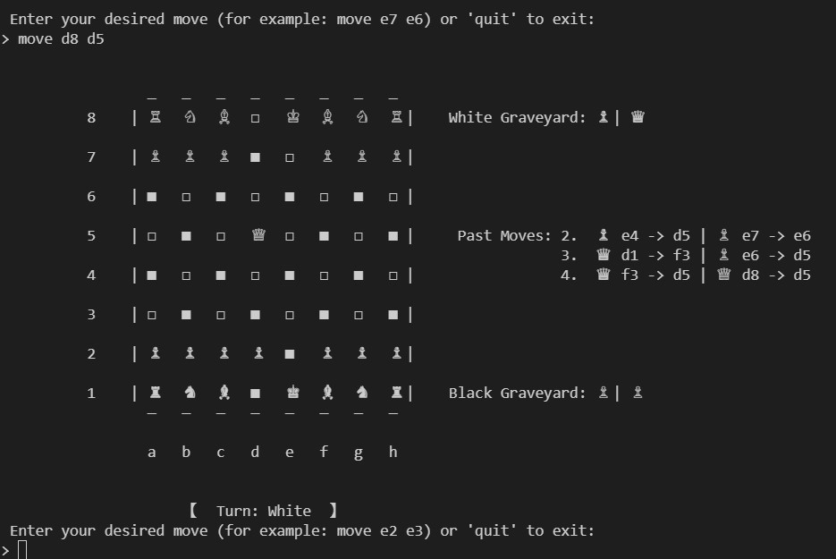
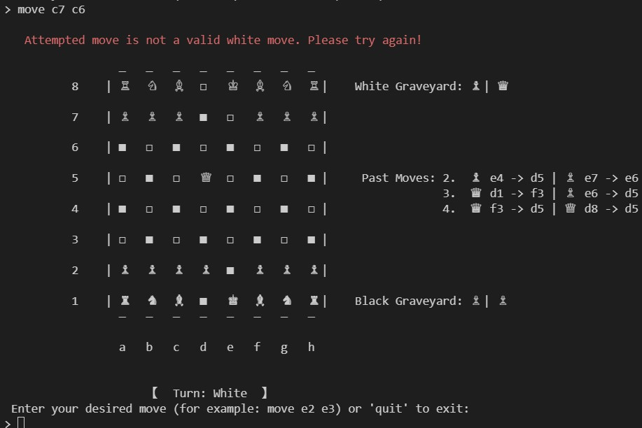
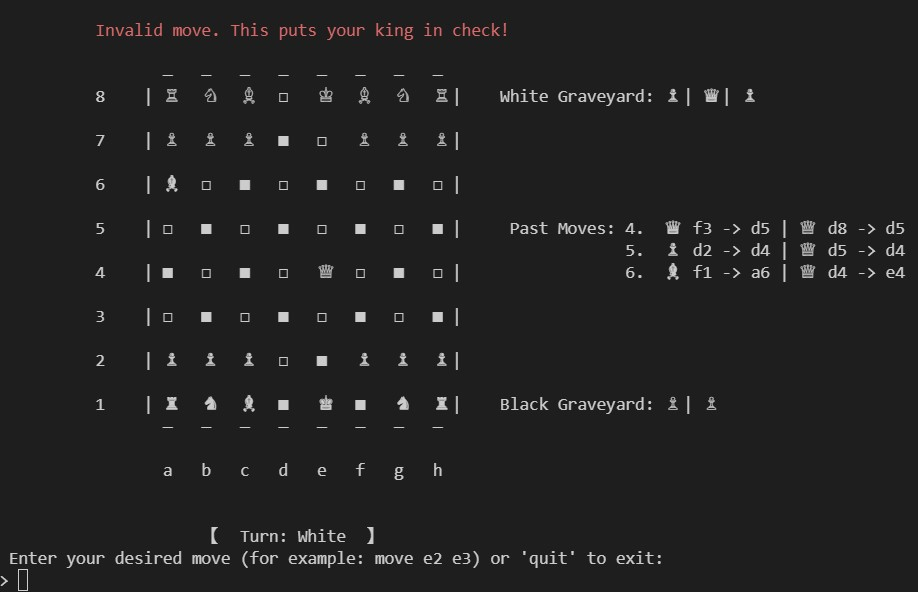
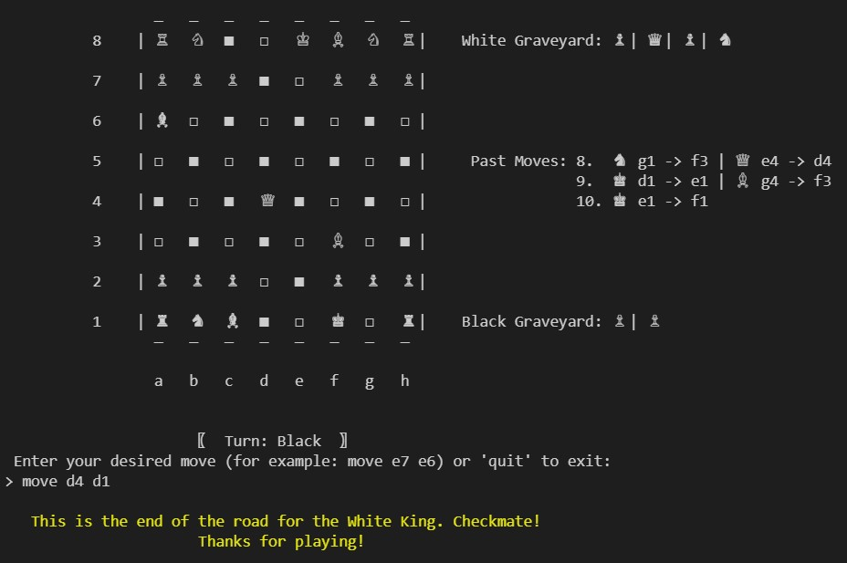

# CamlChess
By: Natan Aklilu, Daniel Botros, Francis Bahk, Young Zheng

This is the final group project for CS 3110: Functional Programming and Data Structures.
We implemented a terminal-based version of Chess in OCaml. This multiplayer game 
comes fully equipped with a realistic chess board, move history, graveyard, and 
even an optional AI opponent. The user interface is straight-forward and contains 
clear instructions.

To run the game, execute the command "make play" within the chess-main 
repository folder. It is recommended to run this on an Ubuntu (WSL) terminal
for the smoothest experience.

# Journey through the game

## Starting a game

When you first run the command to run the game, you will be asked if you would 
like to play. If you say no, you are met with a special goodbye message: 

  

If you say yes, you will be asked whether you would like to play with an AI opponent. 
If you prefer AI, then you will find a temporary loading screen as the AI calculates a move: 

  

If you say no to the AI, then you will be in a local multiplayer chess match where each 
person must input their own moves one after the other. There are clear prompts 
throughout the entire chess game with examples of how to move and whose turn it is: 

## Playing a game

As you can see above, our chess game contains the features mentioned above including
a fully functional chess board, a move history, and a graveyard for each player. 
As stated in the prompt, you perform a move with phrase "move (square_1) (square_2)". 
If you guessed that you are moving the piece you want from square_1 to square_2, then 
you are correct! The game follows the official rules and we provide warnings for illegal moves: 

  

## Finishing a game

As the game comes to a close, the king will be put into check and this must be defended 
or else you will get the above error. In the case of a successful checkmate, the game 
is over and the final message pops up as you see below: 

 

## Hope you enjoy our terminal-based chess game!
